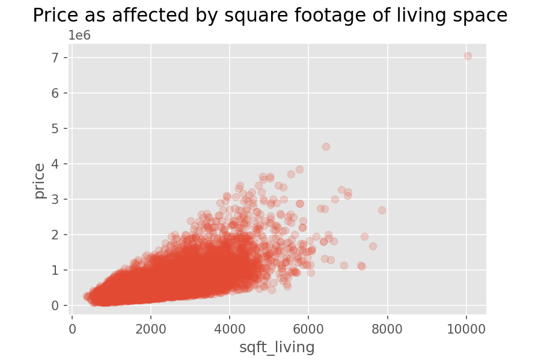
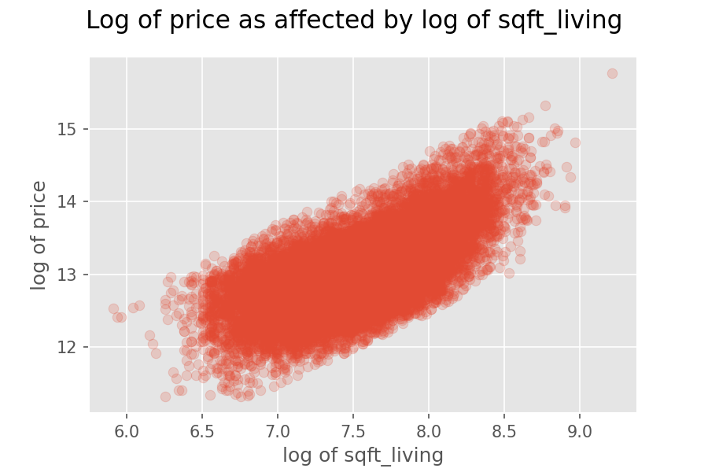

# King County Home Sale Data: Analysis and Modeling
Flatiron School Data Science: Project 2
- **Author**: Zaid Shoorbajee
- **Instructor**: Matt Carr
- **Pace**: Flex, 20 weeks

## Overview and Business Understanding

This project analyzes data about homes sold in King County, Washington between May 2014 and May 2015 in order to make recommendations to a real estate agency. The agency wants to advise its clients on how to increase the estimated sale price of their homes. The analysis will allow the agency to advise clients on 1) what kinds of renovations to make and 2) which aspects of their home to emphasize in a listing.

These are decisions that home sellers can make in an attempt to increase their sale price. Especially with renovations, this information will be useful because it will give sellers a sense of what kinds of renovations will result in a higher expected sale price.

## Data Understanding

The data I have available to me contains information about homes sold in King County between May 2014 and May 2015. The original dataset contains records of 21,597 home sales. It includes information about:
* How much the house sold for
* Square footage of the house's living space
* Square footage of the lot
* Number of floors, bedrooms, and bathrooms
* The quality of the view from the house
* Whether the house is on a waterfront
* The house's grade (relates to construction materials and quality)
* The house's condition (relates to age and maintenance)
* The year the house was built
* The year the house was renovated
* The location of the house
* The square footage of the house and lot of the nearest 15 neighbors

I use the sale price as the target variable, as it's the value we want to predict on behalf of the real estate agency and its clients.

Ultimately, I drop several of these features before constructing models because they may not be useful to a homeowner or they aren't for someone selling their home to change. For example, if your house is not in a specific ZIP Code, you can't change that before you sell it.

### Baseline model

The predictor that is most correlated with price is `sqft_living`, or the square footage of the living area of the house. I used this feature alone in the baseline model.

However, this baseline model **violated conditions of normality and homoscedasticity** of the residuals. The conditions were better met after I log-transformed both `price` and `sqft_living`.

This baseline model had a relatively low R-squared score of 0.441. To try to improve the fit of the model, I experimented by adding several features in subsequent models.

### Iterations and final model

In trying to improve the model, I tried including different permutations of the predictors below. The final model included the ones marked by an asterisk.
* **Square footage of the living space (logged)** *
* **Condition (categorical)** * 
* **Grade (categorical)** *
* **Number of floors (categorical)** *
* **View (binary)** *
* **Waterfront (binary)** * 
* Number of bedrooms (categorical)
* Number of bathrooms (categorical)

**The notebook in this repository titled `King_County_analysis.ipynb` contains more details about how I iterated on these models and arrived at the final one. It also includes more comprehensive summaries of each model, including coefficients and p-values.**

## Conclusions
### Final model
**The final model has an improved R-squared score of 0.590 and yields information that allows us to make useful inferences about the predicted sale price of a house, as well what actions a homeowner may take in order to increase it.**

**Square footage of living space:** Increasing the square footage is associated with a higher sale price. Generally speaking, if a homeowner is able to increase this, the house can be expected to sell for more.

**Condition of the house (maintenance):** The reference point for the model is a house with a condition of "2_Fair." If the homeowner can do some maintenance to improve the condition of the house to any higher classification, the expected sale price should go up.

**Grade of the house (quality of construction):** The reference point for the model is a house with a grade of "5_Fair." Higher grades are associated with higher sale prices. If the homeowner can overhaul the quality of the construction and design of the house, that is expected to increase the sale price.

**Number of floors**: The fit of the model improved by taking this into account, but the coefficients are harder to interpret. The reference point is a house with 1 floor, so it seems illogical that going from 1 floor to 1.5 floors would increase the price, but going to 2 floors, would decrease it. It should be noted that a house with 1.5 floors is similar to one with 2 floors, and a house with 2.5 floors is similar to one with 3 floors. Generally speaking, adding floors to a house would increase sale price, but it's also unclear if that kind of renovation (which is probably very costly) would be worth the price increase.

**Waterfront and view**: Houses that are on a waterfront and houses with nice views will tend to sell for higher than houses that don't have these features. If either is true, then the real estate agency should emphasize these in the listing, photos, and any other marketing for the home sale.

**Renovated in the last 10 years**: Houses renovated in the past 10 years also tend to sell for higher. This aspect is probably also associated with condition and grade. Regardless, recent renovations should be emphasized in the listing and any marketing for the home sale.

## Limitations

A major limitation of the final model is that it doesn't predict the effect on home sale price in terms of dollars. The data has been transformed by taking the natural log of price and square footage. This was done in order to meet the assumptions of linear regression, but it makes the model less intuitive to interpret. As a result, we can tell whether a variable increases or decreases a home sale price, and we can tell the relative magnitude of the change, but figuring out the effect in terms of dollars requires some more advanced calculations. This can be limiting for someone who, say, wants to weigh whether a certain renovation will pay off when they sell their house. 

Another limitation is the final model's adjusted R-squared score. A score of 0.59 is not exemplary. We can still make meaningful inferences about how much price will change if a predictor is change, but we have to hedge these claims by saying that 41% of the variation in price is not explained by the predictors.
